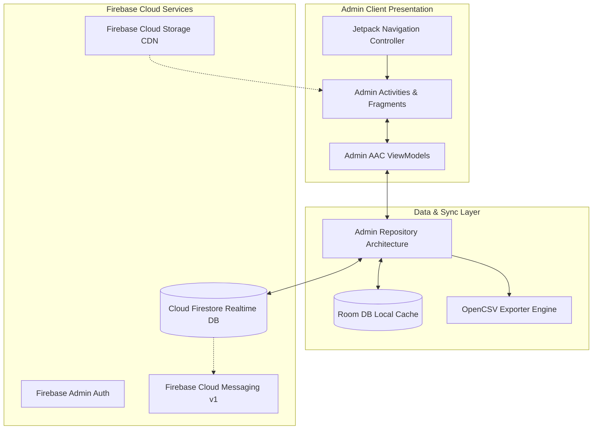
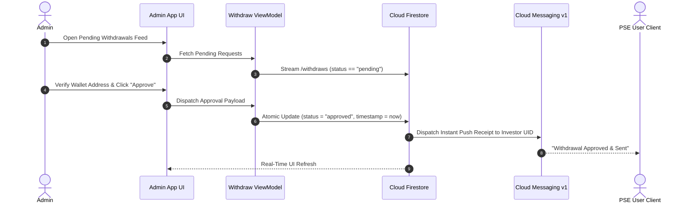

# Philippine Stock Exchange (PSE Admin Control Panel)

[](https://developer.android.com)
[](https://kotlinlang.org/)
[](https://developer.android.com)
[](https://developer.android.com/topic/architecture)
[](https://firebase.google.com/docs/firestore)
[](LICENSE)

> Enterprise Android administration and financial compliance console for the Philippine Stock Exchange platform, managing user account balances, USDT payout queues, stock package configurations, OpenCSV audit logging, and live help desk messaging.

---

## 📖 Overview

**Philippine Stock Exchange (PSE) Admin** is the centralized operational command center designed for back-office teams, risk compliance managers, and platform operators. Engineered with **Kotlin**, **Android SDK 36**, **Room DB persistence**, and **Clean MVVM Architecture**, the application interfaces directly with **Cloud Firestore** to oversee liquidity reserves, execute crypto payout approvals, manage stock plan offerings, and support users in real time.

### Operational Objectives
- **Risk & Capital Oversight**: Monitor platform-wide liquidity, active investor numbers, aggregate balances, and pending liability queues.
- **Crypto Payout Moderation**: Verify recipient blockchain wallet addresses (USDT-BEP20 / TRC20) and disburse or reject payouts with automated FCM v1 notifications.
- **Dynamic Stock Plan & Tier Management**: Configure equity packages, set daily ROI percentages, adjust duration limits, and fine-tune multi-tier MLM commission percentages.
- **Direct Support Command Desk**: Engage in 1-on-1 real-time chats with investors, broadcast system notices, and upload visual promotional posters to Firebase Storage.
- **Audit & Financial Reconciliation**: Export user balances and transaction logs to CSV spreadsheets via OpenCSV for tax and compliance auditing.

---

## 🏗️ Architecture & Operations Flow



### Payout Approval & Balance Verification Flow



---

## ✨ Core Features

### 1. 📊 Executive Operations Cockpit
- **Live Platform Metrics**: Real-time counter widgets displaying Total Users, Active Investors, Inactive Accounts, and Outstanding Liabilities.
- **User Directory & Balance Editor**: Searchable directory of registered users with full profile inspection, portfolio holdings, and ledger adjustment tools.

### 2. 💸 Crypto Payout Approval Queue
- **Categorized Moderation Views**: Dedicated tabs for `All Requests`, `Approved Withdrawals`, and `Rejected History`.
- **Atomic State Transitions**: Execute instant approvals or log detailed rejection reasons, automatically synchronizing with the user's transaction ledger.

### 3. ⚙️ Dynamic Plan Catalog & Tier Settings
- **Stock Package Creator**: Provision new equity investment plans specifying minimum deposit thresholds, daily return yields, and maturity durations.
- **MLM Tier Multipliers**: Configure downstream affiliate bonus percentages and rank promotion requirements dynamically.

### 4. 📢 Broadcast Announcements & Media Banners
- **Cloud Storage Posters**: Upload high-resolution promotional banners directly to Firebase Storage for display on user dashboards.
- **System Announcements**: Broadcast real-time urgent notifications and maintenance alerts across the ecosystem.

### 5. 💬 Customer Help Desk & CSV Auditing
- **Live Support Chat**: Manage multi-user support conversations with real-time typing indicators and message timestamps.
- **OpenCSV Financial Reports**: Export platform accounting data, withdrawal histories, and active balance sheets to standard CSV format.

---

## 📱 Key Screens & Navigation Map

| Module | Fragment / Activity | Description |
|---|---|---|
| **Admin Auth** | `LoginActivity`, `LauncherActivity`, `SignUpActivity` | Administrative login, session validation, secure credentials storage. |
| **Dashboard** | `HomeFragment` | Real-time liquidity indicators, pending task counters, quick navigation tiles. |
| **Withdrawal Desk** | `WithdrawalsRequestsFragment`, `ApprovedWithdrawsFragment`, `RejectedWithdrawsFragment` | Payout moderation queues with blockchain verification tools. |
| **User Directory** | `UserFragment`, `ActiveUsersFragment`, `UsersWithBalanceFragment`, `CreateUserFragment` | Searchable investor roster, balance inspection, and manual adjustments. |
| **Plan Manager** | `InvestmentPlansFragment`, `PlansByCategoryFragment`, `PlanDetailFragment`, `PlanSettingFragment` | Dynamic investment product creation and affiliate tier multipliers. |
| **Support Center** | `ChatFragment`, `DetailChatFragment` | Real-time administrative chat desk with Firestore streaming. |
| **Broadcast Desk** | `AnnouncementsFragment`, `AddPosterFragment`, `NotificationFragment` | Image poster uploads and platform-wide announcement broadcasts. |

---

## 🛠️ Technology Stack Matrix

| Layer | Technologies / Libraries |
|---|---|
| **Language & Tooling** | Kotlin 2.0, JDK 17/21, Gradle Version Catalogs, Android SDK 36 |
| **UI Framework** | Android Jetpack (ViewBinding, Fragments, Navigation Component, Material 3) |
| **Architecture** | MVVM (Model-View-ViewModel), Repository Pattern, Clean Architecture |
| **Local Persistence** | Android Jetpack Room DB (KSP compiler), Encrypted SharedPreferences |
| **Reporting & Export** | OpenCSV 5.7.1 for spreadsheet generation and auditing |
| **Backend & Cloud** | Google Firebase (Auth, Cloud Firestore NoSQL, Cloud Storage, FCM v1) |
| **Networking & Media**| OkHttp3, Google OAuth2 Http, Glide 4.16, Lottie, gRPC Protobuf-Lite |

---

## 🚀 Getting Started

### Prerequisites
- **Android Studio Ladybug (2024.2.1+)** or newer.
- **JDK 17** configured as the Gradle JVM.
- **Android SDK 36** installed.
- Administrative Firebase Project with Firestore rules and Cloud Messaging configured.

### Installation & Setup

1. **Clone the Repository**:
   ```bash
   git clone https://github.com/shayann07/Philippine-Stock-Exchange-admin.git
   cd Philippine-Stock-Exchange-admin
   ```

2. **Configure SDK Location**:
   ```bash
   cp local.properties.example local.properties
   ```
   Add your Android SDK path in `local.properties`.

3. **Firebase Credentials**:
   Add your administrative `google-services.json` to the `app/` folder:
   ```text
   app/google-services.json
   ```

4. **Build & Execute**:
   ```bash
   # Assemble Debug APK
   ./gradlew assembleDebug

   # Run Unit Tests
   ./gradlew testDebugUnitTest
   ```

---

## 📄 License

This project is open-source software licensed under the [MIT License](LICENSE) — Copyright (c) 2026 [shayann07](https://github.com/shayann07).
