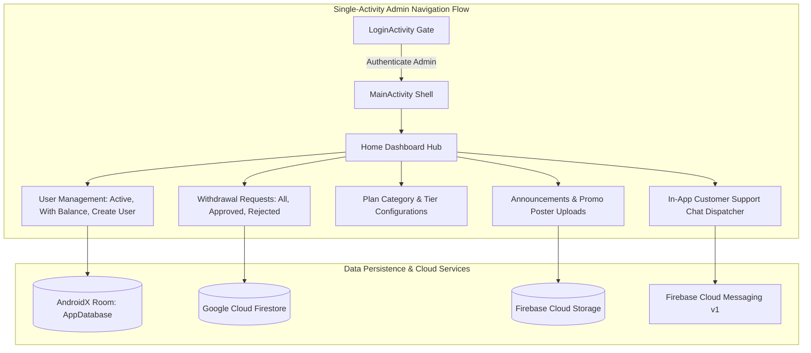

# Philippine Stock Exchange (PSE) — Android Admin Management Console

[](https://kotlinlang.org)
[](https://developer.android.com)
[](https://gradle.org)
[](https://developer.android.com/training/data-storage/room)
[](https://firebase.google.com)
[](LICENSE)

Philippine Stock Exchange (PSE) Admin is an administrative operations console application built in Kotlin, Jetpack Navigation, AndroidX Room local caching, and Firebase Firestore, designed for portfolio auditing, user management, withdrawal approval workflows, and support ticket dispatching.

---

## Admin Architecture & Navigation Flow



---

## Key Features

- **Administrative Operations Dashboard**: Real-time aggregation counters (Active, Inactive, and Total Users) with user balance auditing tools.
- **Withdrawal Processing Workflows**: Multi-tab withdrawal approval queue (All Requests, Approved History, Rejected Auditing) with atomic balance deduction triggers.
- **Investment Tier Management**: Visual plan creator and category tier configuration editor with real-time Firestore database sync.
- **In-App Customer Support Dispatcher**: Real-time bi-directional customer support chat interface for administrative agents.
- **Announcement & Poster Management**: Cloud Storage integrated poster upload manager for distributing platform notices.

---

## Technical Stack

| Component | Library / Framework | Version |
|---|---|---|
| **Language** | Kotlin | 2.0.21 |
| **Build System** | Android Gradle Plugin / Gradle | 8.11.1 / 8.11.1 |
| **SDK Levels** | Compile SDK: 36, Target SDK: 36, Min SDK: 24 | Android 7.0+ |
| **Local Database** | AndroidX Room (AppDatabase schema v4) | 2.7.0 |
| **Cloud Services** | Firebase Auth, Cloud Firestore, Cloud Storage, FCM | Firebase BoM 32.3.0 |
| **Navigation & UI** | Jetpack Navigation Component + ViewBinding + SwipeRefresh | 2.7.7 |
| **Networking & Utilities** | OkHttp3, Gson, Glide, Lottie, ZXing | 4.12.0 / 2.12.1 |

---

## Setup & Local Development

### Prerequisites
- Android Studio Ladybug (2024.2.1+) or newer
- JDK 17 / Java 11 runtime
- Android SDK 36 installed

### Step-by-Step Configuration

1. **Clone the Repository:**
   ```bash
   git clone https://github.com/shayann07/Philippine-Stock-Exchange-admin.git
   cd Philippine-Stock-Exchange-admin
   ```

2. **Configure Firebase Credentials:**
   Copy the example configuration template:
   ```bash
   cp app/google-services.json.example app/google-services.json
   ```

3. **Configure Local SDK:**
   ```bash
   cp local.properties.example local.properties
   ```

4. **Build the Admin Application:**
   ```bash
   ./gradlew assembleDebug
   ```

---

## Repository Structure

```
Philippine-Stock-Exchange-admin/
├── app/
│   ├── src/main/
│   │   ├── java/com/codingempire/adminpse/
│   │   │   ├── adapters/       # User, Withdrawal, Plan, Chat adapters
│   │   │   ├── database/       # Room entities (UserModel, WithdrawModel) & AppDatabase
│   │   │   ├── fragments/      # Home, Users, Withdrawals, Plans, Chat, Posters
│   │   │   ├── notifications/  # FCM NotificationService & AccessToken client
│   │   │   ├── models/         # Domain data transfer objects
│   │   │   └── ui/             # LoginActivity, MainActivity, view binding helpers
│   │   ├── res/                # Layouts, navigation graph, drawables
│   │   └── AndroidManifest.xml # Entry activities & permissions
│   ├── google-services.json.example
│   └── build.gradle.kts
├── local.properties.example
├── LICENSE                     # MIT License
└── README.md
```

---

## License

Distributed under the MIT License. See [LICENSE](LICENSE) for more information.

Copyright (c) 2026 **shayann07**
